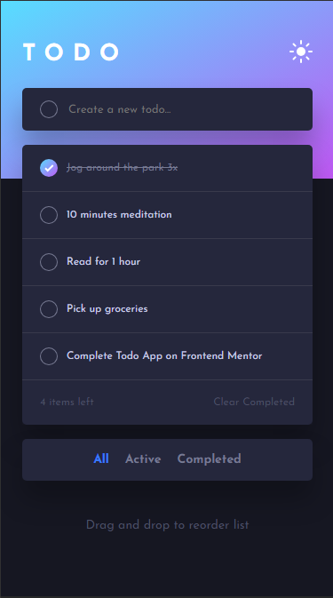
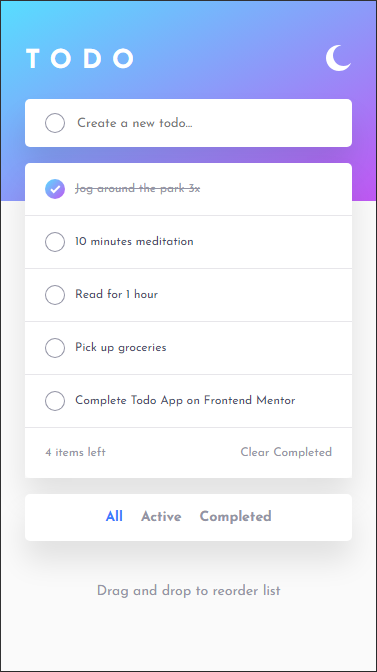

# Todo App

This is a solution to the Todo app challenge on Frontend Mentor using vanilla JS, HTML, and SCSS. It's a CRUD application that utilises the browser's built in local storage to store and manipulate tasks that are added by the user.

## Table of contents

- [Built with](#built-with)
- [Preview](#preview)
  - [Desktop version](#desktop-version)
  - [Mobile version](#mobile-version)
- [Author](#author)

## Built with

- Semantic HTML markup
- [Sass partials](https://sass-lang.com/documentation/at-rules/use/#partials)
- [Sass functions](https://sass-lang.com/documentation/at-rules/function/)
- [Sass mixins](https://sass-lang.com/documentation/at-rules/mixin/)
- CSS custom properties
- CSS flexbox
- Mobile-first workflow
- SVGs

## Preview

### Desktop version

Dark mode  

Light mode  

### Mobile version

Dark mode  

Light mode  

## Author

- LinkedIn - [Venus Yip](https://www.linkedin.com/in/venus-yip-869aa4217/)
- Frontend Mentor - [@VenusY](https://www.frontendmentor.io/profile/VenusY)
