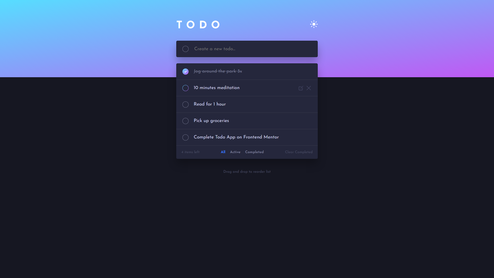
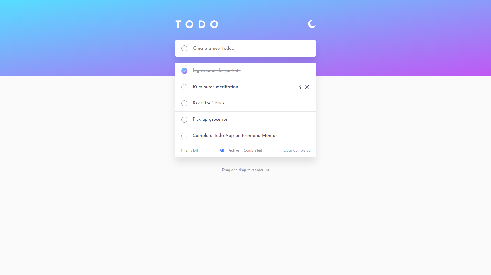
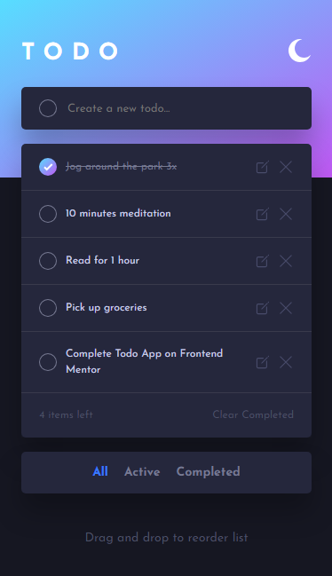
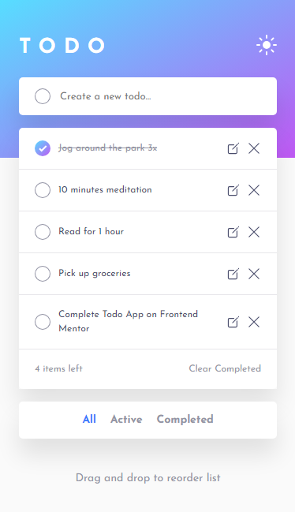

# Todo App

This is a solution to the Todo app challenge on Frontend Mentor using vanilla JS, HTML, and SCSS. It features an edit button and a corresponding confirm edit button as an extra feature to facilitate the editing of existing tasks.

It utilises the browser's built in local storage to allow CRUD operations carried out by the user to persist between sessions as long as the user does not clear the local storage.

## Link to app

https://venusy.github.io/todo-app/

## Table of contents

- [Built with](#built-with)
- [Preview](#preview)
  - [Desktop version](#desktop-version)
  - [Mobile version](#mobile-version)
- [Author](#author)

## Built with

- Semantic HTML markup
- [Sass partials](https://sass-lang.com/documentation/at-rules/use/#partials)
- [Sass functions](https://sass-lang.com/documentation/at-rules/function/)
- [Sass mixins](https://sass-lang.com/documentation/at-rules/mixin/)
- CSS custom properties
- CSS flexbox
- Mobile-first workflow
- SVGs

## Preview

### Desktop version

Dark mode  

Light mode  

### Mobile version

Dark mode  

Light mode  

## Author

- LinkedIn - [Venus Yip](https://www.linkedin.com/in/venus-yip-869aa4217/)
- Frontend Mentor - [@VenusY](https://www.frontendmentor.io/profile/VenusY)
